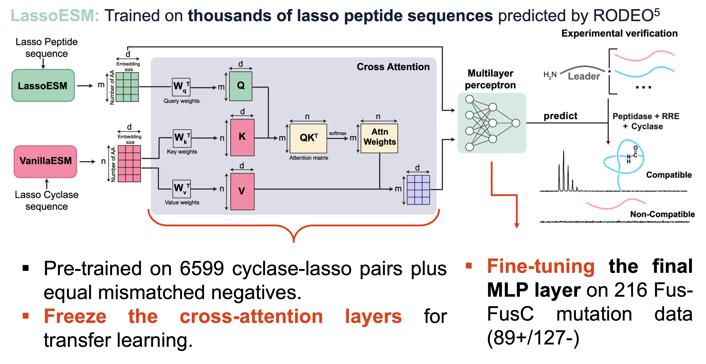
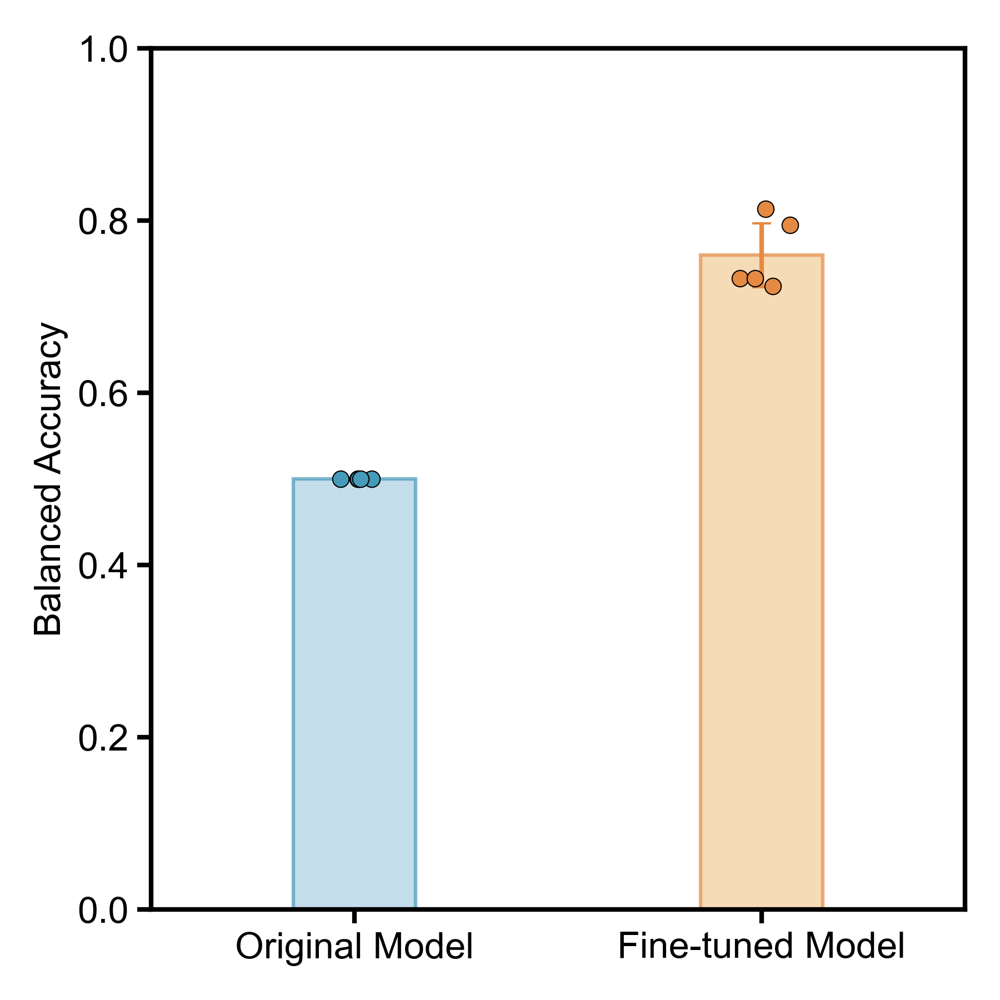

# Lasso cyclase functions as a chaperone mediating peptide folding and binding

  

  <a href="./figure/SongYin_AICHE_2025_Lasso.pdf">Poster</a> | <a href="">Paper</a> | <a href="">Data Repository</a> | <a href="">Code Repository</a>

## Transfer Learning

Fine-tuning Pre-trained Cyclase-Substrate Cross-Attention Model (LassoESM) on Fus-FusC Mutation Data. This model enables robust prediction of FusC-Fus cyclase-substrate tolerance.

**Sample Code:** [`ft_lassoesm_CV.py`]() 

**Preliminary Result:**

  

## License

**© 2025 Song Yin. All Rights Reserved.**

This code is made available for viewing purposes only. No permission is granted to use, copy, modify, or distribute this code for any purpose.